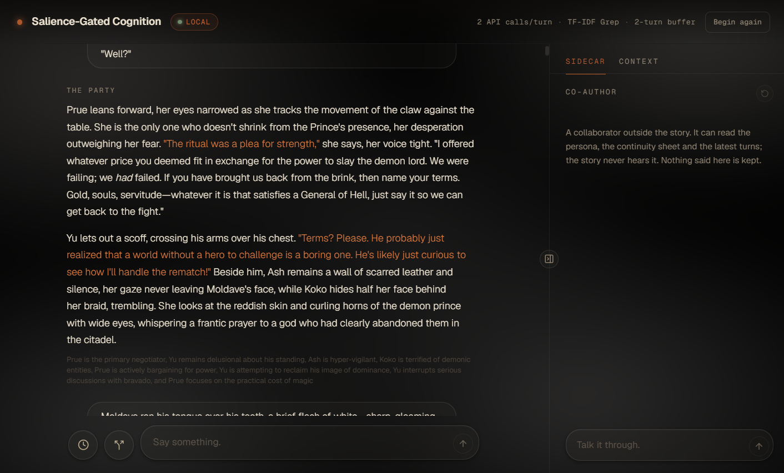

# SGC — Salience-Gated Cognition

**An indefinitely long conversation with a character who never forgets and
never drifts, without the context window ever growing.**



*The header states the architecture. The grey line beneath the reply is the
state turn's summary, which the grep indexes alongside the raw text. The
Sidecar reads the story and never writes to it.*

SGC is a narrative runtime: a roleplay engine with a memory architecture
underneath. Every reply is written by a fresh model instance that is handed
only what a deterministic memory system decided was relevant, then retired.
Retrieval over the story's history is pure math, TF-IDF cosine × BM25, at
0 ms and 0 tokens. There is no vector database, no embeddings, and no model
anywhere in the memory path.

It exists to answer one question: can a chat run for thousands of turns and
resolve the failure modes of long context windows, drift, sycophancy and
prompt abandonment? It can. It is a personal research project, not a product,
and the docs stay honest about that.

## How a turn works

1. **The client assembles a context** from curated tiers: a per-chat
   *constitutional document* about the user, a *continuity sheet* of scene
   facts, the last two turns verbatim, the two before that as summaries, the
   best matches from a deterministic grep over everything older, and any
   mounted knowledge packs.
2. **Sal replies.** Sal is the reasoning instance, built fresh for this turn
   with that context and nothing else. If it senses there is more to
   remember, it can re-query the grep with its own query (`recall`), up to
   twice. The reply is prose only.
3. **A small state turn distils the exchange** into a turn summary, a
   schema-capped *inner state* (goal, feeling, what it noticed, what it wanted
   to say and didn't) that colours the next reply without being narrated, and
   deltas to the continuity sheet. Code merges the deltas. The summaries and
   retrieval cues are indexed by the grep alongside the raw turns.

Two API calls per turn in the base loop. Nothing accumulates: the inner state
is regenerated every turn and editable by the user, the continuity sheet
accretes only through schema-bound deltas, and everything else is rebuilt from
the tiers. The full description is in [`docs/architecture.md`](docs/architecture.md).

## What you can do

- **Edit or re-spin the latest reply.** Rewrite it by hand, or regenerate it
  with history reconstructed as it was at that instant. The kept text is
  re-indexed and its summary and state re-derived.
- **Undo a turn.** The pair is deleted from the thread, the database and the
  grep corpus, and your message returns to the composer.
- **Open a tangent.** Bookmark the current turn, experiment, then make it
  canon or wipe everything past the bookmark. Because state is stored per
  turn, wiping the rows is the rollback.
- **Talk to the Sidecar.** A co-author chat beside the story that reads a
  snapshot of it and writes nothing back. Ask "has Steve told her yet?"
  without it becoming a canon turn.
- **Find in thread.** Ctrl/Cmd-F: exhaustive literal search over every
  message, the counterpart to the grep's ranked few.
- **Mount knowledge packs.** Read-only reference material, searched by the
  same math and rendered as a separate tier. Knowledge about the world, not
  memory of the person.
- **Rewrite the persona** per chat or mid-chat with a forward-only edit
  history, and give the character a display name that never reaches the
  model.
- **Paste a link.** The server extracts the page's text before the call and
  folds it into the prompt. No browsing loop.

## Stack

React + TypeScript (Vite, Tailwind v4, shadcn/ui) client. Express server that
holds the provider keys, streams turns over SSE, enforces the reply's drawn
paragraph ceiling, and persists to SQLite (better-sqlite3). Electron shell for
Windows and macOS that embeds the server as a supervised child process.
Providers: Anthropic, or any OpenAI-compatible local server (KoboldCPP,
Ollama), switchable at runtime, with `<think>` blocks stripped at the
provider boundary for reasoning models. Vitest, ESLint, GitHub Actions for
the macOS build.

## Running it

```bash
npm install
cp .env.example .env          # then add your ANTHROPIC_API_KEY
npm run dev
```

The Vite client is on `:5555` and the Express proxy on `:3000`. Open
`http://localhost:5555`. The API key lives only on the server.

**Local model.** Uncomment `OPENAI_BASE_URL` in `.env` (see the LOCAL block in
`.env.example`) and pick the provider from the header chip. Give reasoning
models a roomy `LLM_MAX_TOKENS` (default 4096); thinking comes out of that
budget first.

**Desktop.** `npm run dist:win` packages an NSIS installer into `release/`.
Both providers are configured from the UI (click the header chip); config
lives in `%APPDATA%\sgc\sgc-config.json`, no `.env` needed. The installer
ships two stock knowledge packs. Pushing a `sgc_v*` tag builds an unsigned
arm64 macOS DMG in CI; on first launch, right-click the app → Open, or clear
quarantine with `xattr -cr "/Applications/Salience-Gated Cognition.app"`.

| Command | Does |
|---------|------|
| `npm run dev` | Client + server, hot-reloading |
| `npm run electron:dev` | The same dev stack plus an Electron window |
| `npm test` | Vitest across the retrieval engine, prompt assembly, state turn, continuity, pacing, server routes and desktop shell |
| `npm run typecheck` | `tsc` on client, server, and electron shell |
| `npm run lint` | ESLint |
| `npm run build` | Production build into `dist/` |
| `npm run dist:win` | Windows NSIS installer into `release/` |
| `npm run dist:mac` | macOS arm64 DMG into `release/`, on a Mac or in CI |

## Repository layout

```
src/client/    React + TypeScript UI; lib/ holds the memory-architecture logic
src/server/    Express server — provider keys/URLs, /api/turn (SSE), SQLite persistence
electron/      desktop shell (Windows + mac) — forks the server, supervises, never thinks
resources/     stock knowledge packs bundled into the installer
docs/          architecture, YAML specs, release runbook, changelogs — see docs/README.md
scripts/agent/ Bash utilities for codebase recon and checks
.claude/       Agents, skills, and the pre-commit QA gate
CLAUDE.md      Standing orders for agents — project brief, invariants, values, tooling
AGENTS.md      Confusion pointers — gotchas worth knowing
```

## Working in this repo

`git commit` is gated by a pre-commit QA checklist (`.claude/skills/pre-commit-qa`).
Run `/pre-commit-qa` when work is ready to commit; it walks the checklist and
unlocks commits only if every item passes.

## License

MIT. See [`LICENSE`](LICENSE).
